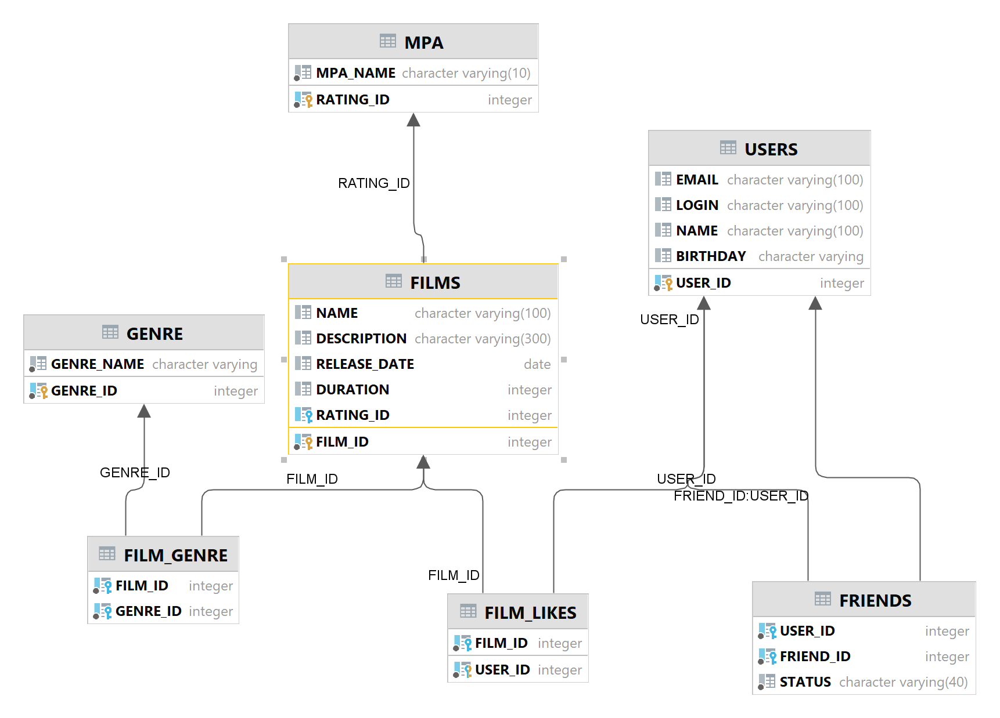

# java-filmorate
Template repository for Filmorate project.

# Описание проекта
Бэкенд социальной сети, которая поможет выбрать фильм в зависимости от того, какие фильмы смотрите вы и ваши друзья. 

# Возможности приложения
- создание, обновление фильмов
- возможность отметки понравившегося фильма
- вывод лучших фильмов
- создание и обновление пользователей
- добавление пользователей в друзья
- удаление пользователей



### Примеры запросов в базу данных

---

<details>
<summary>Получить фильм с id=1</summary>

```sql
    SELECT *
    FROM films
    WHERE film_id = 1;
```

</details>

<details>
<summary>Получить пользователя с id=2</summary>

```sql
    SELECT *
    FROM users
    WHERE user_id = 2;
```

</details>
